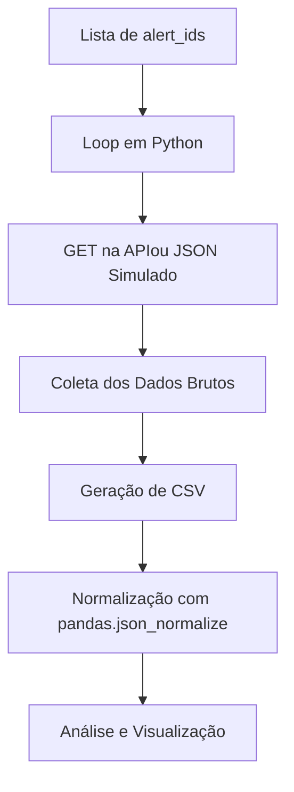

# Compliance Alerts Pipeline

Este projeto simula a coleta, normalização e análise de alertas de compliance a partir de uma API.

## Arquitetura da Solução



## Passo a passo

> Requer: Python 3.11

### Versão Windows

1. Criar o ambiente virtual com o código:  
   `python -m venv <nome_sua_escolha>` (ex: `python -m venv desafio_meli`)

2. Ativar a venv:  
   ```
   cd "nome_sua_escolha"
   Scripts\activate
   ```

3. Instalar requirements:  
   `pip install -r requirements.txt`  
   > Certifique-se de que `requirements.txt` está na pasta da venv.

4. Ainda com a venv ativada, navegue até o arquivo:  
   `extract_compliance_data.py`  
   Caminho esperado:  
   `C:\Users\<user>\<nome_sua_escolha>\project\02_Code`

5. Rodar o script:  
   `python extract_compliance_data.py`

6. Verificar arquivos gerados em:  
   `01_Datasets/`

### macOS / Linux

1. Criar o ambiente virtual com o código:  
   `python3 -m venv <nome_sua_escolha>` (ex: `python3 -m venv desafio_meli`)

2. Ativar a venv:  
   ```
   cd "nome_sua_escolha"
   source bin/activate
   ```

3. Instalar requirements:  
   `pip install -r requirements.txt`  
   > Certifique-se de que `requirements.txt` está na pasta da venv.

4. Ainda com a venv ativada, navegue até o arquivo:  
   `extract_compliance_data.py`  
   Caminho esperado:  
   `/Users/<user>/<nome_sua_escolha>/project/02_Code`

5. Rodar o script:  
   `python3 extract_compliance_data.py`

6. Verificar arquivos gerados em:  
   `01_Datasets/`

---

## Possíveis Bloqueios e Estratégias
### Lista Explicada

1. **Token expirado ou ausente**  
   - Mitigação: configurar variáveis de ambiente `.env`, validar antes da request.

2. **Headers mal formatados**  
   - Mitigação: validações pré-request.

3. **Limite de chamadas por segundo (Rate Limit)**  
   - Mitigação: retry com *exponential backoff*, uso de cache local.

4. **Formatação do JSON variável**  
   - Mitigação: `try/except`, `.get()`, normalização incremental.

5. **Timeout ou falhas de rede**  
   - Mitigação: timeouts explícitos, múltiplas tentativas, JSON simulado.

6. **Problemas no ambiente Python**  
   - Mitigação: versionamento, requirements fixo, garantir PATH funcional.
